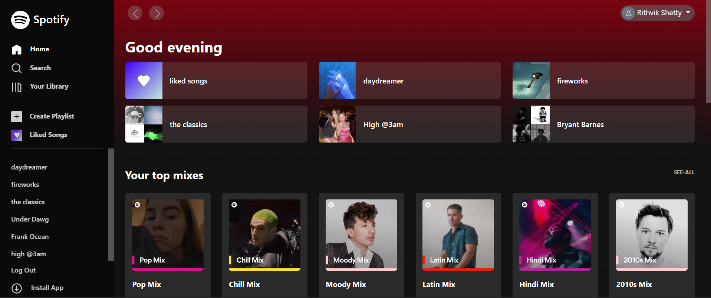

# Spotify Web App Clone

##### A clone of Spotify's web player.

### Here are some usefull resources - 

1. [Introduction to Github and open-source projects.](https://www.digitalocean.com/community/tutorial_series/an-introduction-to-open-source)

2. [How to contribute to open-source projects](https://opensource.guide/how-to-contribute/)

3. [How to use git?](https://www.digitalocean.com/community/cheatsheets/how-to-use-git-a-reference-guide)

### Socials

1. Instagram: https://instagram.com/_ritxvik_
2. Website: https://rithvikshetty.in
3. Linkedin: https://linkedin.com/rithvikshetty

## Contributers

